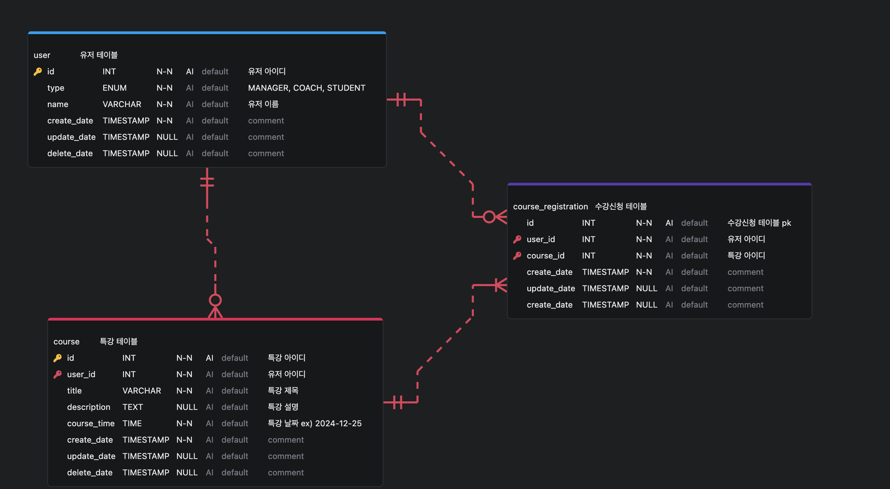

## ERD


```
user
- id 		(pk)
- type		('MANAGER' | 'COACH' | 'STUDENT')
- name		(유저 이름)
- create_date	(timestamp)
- update_date	(timestamp)
- delete_date	(timestamp)

course
- id 		(pk)
- user_id	(특강 강연자 user_id)
- title		(특강 제목)
- description	(특강 설명)
- course_date	(time, ex: 2024-12-01)
- create_date	(timestamp)
- update_date	(timestamp)
- delete_date	(timestamp)

course_registration (수강신청 목록 테이블)
- id 		(pk)
- course_id
- user_id
- create_date	(timestamp)
- update_date	(timestamp)
- delete_date	(timestamp)
- (course_id, user_id) unique
```

### 유저테이블 (user)
type('MANAGER' | 'COACH' | 'STUDENT') 컬럼을 사용해서 유저의 역할을 구분합니다.

### 특강 테이블 (course)
해당 테이블은 특강의 제목, 설명 정보를 가지고 있습니다.

userId 컬럼을 넣어서 COACH 가 아니어도 MANAGER 또는 STUDENT가 특강을 개설할 수 있습니다.

### 특강신청테이블 (course_registration)
과제의 요구사항에 맞게 미리 `특강 1개당 30개의 row를 생성`해둡니다.

각 row는 userId를 Nullable로 가지고 있으며 유저가 특강을 신청하면 해당 row에 userId가 기록됩니다.

30개의 row를 미리 생성해두면 동시에 30명을 초과하는 인원이 수강신청을 해도 `물리적으로 30명 이하의 수강인원을 보장`할 수 있습니다.

특강 1개당 30개의 미리 생성된 row가 존재하므로, userId가 Null인 row에 대해 비관적락(pessimistic_write) 을 사용해서 조금이라도 먼저 lock을 획득한 유저가 특강을 신청 할 수 있게 했습니다.

(course_id & user_id) 로 데이터베이스 유니크 제약조건을 걸어서 `동일한 유저가 같은 특강을 여러번 신청해도 한번만 신청이되는 것`을 보장할 수 있습니다.

## 과제3 테스트코드
인메모리 데이터베이스(sqlite3)는 데이터베이스 수준에서 lock을 지원하지 않기 때문에 테스트컨테이너를 사용해 실제 MySQL DB를 띄워서 사용했습니다.

### 과제3 테스트코드 : https://github.com/jeounpar/course-system-ted/commit/b8c5f4ee00e8ea2b860eb66a7cb2f8f796ddeed3

### 과제4 테스트코드 : https://github.com/jeounpar/course-system-ted/commit/2de6697d232fc2052afecc6c2903a0aabf7e4fc9


